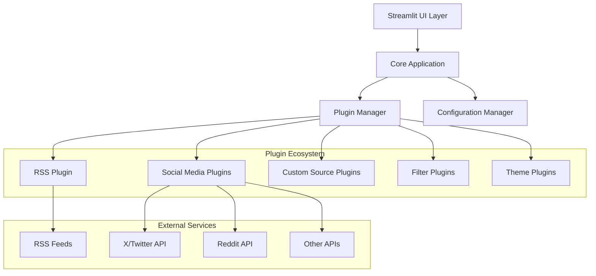

# Design Document: Number Station

## Overview

Number Station is a content aggregation dashboard built on a modular plugin architecture. The system provides unified access to multiple content sources through two distinct UI modes: a chronological stream view and a multi-column board layout. The architecture prioritizes extensibility to support future AI-powered features while maintaining clean separation of concerns.

The system is implemented in Python using Streamlit for rapid development and deployment, with Docker containerization for consistent environments. The plugin architecture allows individual content sources and features to be enabled/disabled independently, supporting both current functionality and planned AI enhancements.

## Architecture

### High-Level Architecture



### Core Components

**Application Core**: Central orchestrator managing plugin lifecycle, configuration, and UI state. Implements the main event loop and coordinates between plugins and UI components.

**Plugin Manager**: Handles plugin discovery, loading, validation, and lifecycle management. Provides standardized interfaces for different plugin types and manages plugin dependencies.

**Configuration Manager**: Persists user preferences, plugin settings, and source configurations. Supports configuration export/import and validation.

**Content Aggregator**: Coordinates content collection from all enabled source plugins, normalizes content items, and manages update scheduling.

**UI Controller**: Manages the dual-mode interface (Stream/Board), handles user interactions, and coordinates with theme plugins for visual customization.

### Plugin Architecture

The plugin system uses a registry-based approach with standardized interfaces:

```python
# Plugin Base Classes
class SourcePlugin(ABC):
    @abstractmethod
    def fetch_content(self) -> List[ContentItem]: pass

    @abstractmethod
    def validate_config(self, config: Dict) -> bool: pass

class FilterPlugin(ABC):
    @abstractmethod
    def filter_content(self, items: List[ContentItem]) -> List[ContentItem]: pass

class ThemePlugin(ABC):
    @abstractmethod
    def apply_theme(self, ui_context: UIContext) -> None: pass
```

**Plugin Discovery**: Plugins are discovered through entry points in setup.py or through a plugins directory. Each plugin must implement the appropriate base class and provide metadata.

**Plugin Lifecycle**: Initialize → Validate → Start → Run → Stop → Cleanup. The Plugin Manager handles state transitions and error recovery.

**Plugin Communication**: Plugins communicate through the core application using event hooks and shared data structures. Direct plugin-to-plugin communication is discouraged to maintain loose coupling.

## Components and Interfaces

### Content Item Schema

All content sources normalize their data into a standardized ContentItem:

```python
@dataclass
class ContentItem:
    id: str
    source: str
    source_type: str  # 'rss', 'twitter', 'reddit', etc.
    title: str
    content: str
    author: Optional[str]
    timestamp: datetime
    url: str
    tags: List[str]
    media_urls: List[str]
    metadata: Dict[str, Any]
```

### RSS Plugin Interface

The RSS plugin handles feed discovery, parsing, and content normalization:

```python
class RSSPlugin(SourcePlugin):
    def __init__(self):
        self.feeds: List[RSSFeed] = []
        self.parser = feedparser

    def add_feed(self, url: str, tags: List[str] = None) -> bool:
        # Validate and add RSS feed

    def fetch_content(self) -> List[ContentItem]:
        # Fetch from all configured feeds
        # Parse using feedparser library
        # Normalize to ContentItem schema
```

### Social Media Plugin Interface

Social media plugins implement platform-specific API integration:

```python
class TwitterPlugin(SourcePlugin):
    def __init__(self):
        self.api_client = None
        self.search_terms: List[str] = []
        self.rate_limiter = RateLimiter()

    def authenticate(self, credentials: Dict) -> bool:
        # Handle OAuth authentication

    def fetch_content(self) -> List[ContentItem]:
        # Respect rate limits
        # Fetch tweets based on search terms
        # Normalize to ContentItem schema
```

### UI Mode Controllers

**Stream Mode Controller**: Manages chronological content display with infinite scroll, content filtering, and real-time updates.

**Board Mode Controller**: Manages multi-column layout with customizable lanes, drag-and-drop organization, and column-specific filtering.

### Configuration Interface

```python
class ConfigurationManager:
    def __init__(self):
        self.config_path = "config.json"
        self.user_prefs = UserPreferences()
        self.plugin_configs = {}

    def save_config(self) -> bool:
        # Persist configuration to disk

    def load_config(self) -> bool:
        # Load configuration from disk

    def validate_config(self, config: Dict) -> bool:
        # Validate configuration schema
```

## Data Models

### Core Data Models

**UserPreferences**: Stores UI mode selection, theme choice, update intervals, and display preferences.

**SourceConfiguration**: Contains connection details, authentication credentials, and source-specific settings for each configured content source.

**ContentCache**: Implements LRU caching for content items with configurable retention policies and size limits.

**PluginMetadata**: Stores plugin information including version, dependencies, capabilities, and configuration schema.

### Database Schema (SQLite)

```sql
-- Content storage for offline access and caching
CREATE TABLE content_items (
    id TEXT PRIMARY KEY,
    source TEXT NOT NULL,
    source_type TEXT NOT NULL,
    title TEXT NOT NULL,
    content TEXT,
    author TEXT,
    timestamp DATETIME NOT NULL,
    url TEXT NOT NULL,
    tags TEXT, -- JSON array
    media_urls TEXT, -- JSON array
    metadata TEXT, -- JSON object
    created_at DATETIME DEFAULT CURRENT_TIMESTAMP
);

-- Plugin configuration storage
CREATE TABLE plugin_configs (
    plugin_name TEXT PRIMARY KEY,
    config_data TEXT NOT NULL, -- JSON object
    enabled BOOLEAN DEFAULT TRUE,
    updated_at DATETIME DEFAULT CURRENT_TIMESTAMP
);

-- User preferences storage
CREATE TABLE user_preferences (
    key TEXT PRIMARY KEY,
    value TEXT NOT NULL,
    updated_at DATETIME DEFAULT CURRENT_TIMESTAMP
);
```

### Content Normalization Pipeline

1. **Raw Content Ingestion**: Each source plugin fetches content in its native format
2. **Schema Mapping**: Convert platform-specific fields to ContentItem schema
3. **Content Sanitization**: Clean HTML, validate URLs, extract media
4. **Metadata Enrichment**: Add source metadata, extract tags, calculate relevance scores
5. **Deduplication**: Identify and merge duplicate content across sources
6. **Storage**: Cache normalized content items for offline access

## Correctness Properties

*A property is a characteristic or behavior that should hold true across all valid executions of a system—essentially, a formal statement about what the system should do. Properties serve as the bridge between human-readable specifications and machine-verifiable correctness guarantees.*

Based on the prework analysis, here are the key correctness properties for Number Station:

### Core System Properties

**Property 1: Plugin Initialization Consistency**
*For any* system startup with enabled plugins, all plugins marked as enabled should be in an initialized state after startup completes
**Validates: Requirements 1.2**

**Property 2: UI Mode State Consistency**
*For any* user session, the displayed UI mode should always match the user's current mode selection
**Validates: Requirements 1.3**

**Property 3: Configuration Round-Trip Persistence**
*For any* valid configuration (user preferences, plugin settings, source configurations), saving then loading should produce an equivalent configuration
**Validates: Requirements 1.4, 10.1, 10.2, 10.3, 10.4**

**Property 4: Error Logging and Continuity**
*For any* system error that occurs during operation, the error should be logged and the system should continue operating
**Validates: Requirements 1.5**

### UI Mode Properties

**Property 5: Stream Mode Chronological Ordering**
*For any* content displayed in Stream Mode, items should be ordered chronologically by timestamp
**Validates: Requirements 2.1**

**Property 6: Board Mode Lane Organization**
*For any* Board Mode configuration, content should be organized into the configured number of lanes
**Validates: Requirements 2.2, 2.5**

**Property 7: Mode Switching State Preservation**
*For any* UI mode switch operation, the current content state should be preserved after the mode change
**Validates: Requirements 2.3**

**Property 8: Lane Configuration Persistence**
*For any* Board Mode lane assignment changes, the assignments should persist across sessions
**Validates: Requirements 2.6**

### Content Aggregation Properties

**Property 9: RSS Feed Validation**
*For any* RSS feed URL, valid URLs should be accepted and invalid URLs should be rejected with appropriate error messages
**Validates: Requirements 3.1**

**Property 10: Content Fetch Scheduling**
*For any* configured fetch interval, content should be fetched according to the specified timing
**Validates: Requirements 3.2**

**Property 11: Web Scraping Selector Compliance**
*For any* configured web scraping selectors, content extraction should follow the defined selector rules
**Validates: Requirements 3.3**

**Property 12: Content Normalization Consistency**
*For any* content from any source (RSS, social media, custom), the normalized output should be a valid ContentItem conforming to the standard schema
**Validates: Requirements 3.4, 4.5, 9.2**

**Property 13: Exponential Backoff Retry Pattern**
*For any* failed RSS feed fetch, retry intervals should follow an exponential backoff pattern
**Validates: Requirements 3.5**

**Property 14: Feed Metadata Accuracy**
*For any* RSS feed, stored metadata (last update time, item count) should accurately reflect the current feed state
**Validates: Requirements 3.6**

### Social Media Integration Properties

**Property 15: Social API Integration Compliance**
*For any* configured social media platform, the integration should fetch content according to the configured search terms and respect API rate limits
**Validates: Requirements 4.1, 4.2, 4.3, 4.6**

**Property 16: Platform Configuration Flexibility**
*For any* social media platform, users should be able to configure platform-specific search terms and tags
**Validates: Requirements 4.4**

**Property 17: API Error Handling Clarity**
*For any* invalid API credentials, the system should display clear, actionable error messages
**Validates: Requirements 4.7**

### Custom Source Management Properties

**Property 18: Custom Source Validation**
*For any* custom source configuration, the system should validate the configuration before saving
**Validates: Requirements 5.3, 5.5**

**Property 19: Custom Source CRUD Operations**
*For any* custom source, users should be able to create, read, update, and delete the source configuration
**Validates: Requirements 5.4**

**Property 20: Custom Source Diagnostic Reporting**
*For any* failed custom source, the system should provide diagnostic information about the failure
**Validates: Requirements 5.6**

### Plugin Architecture Properties

**Property 21: Plugin Registry Functionality**
*For any* valid plugin, it should be discoverable through the plugin registry system
**Validates: Requirements 6.1, 7.1**

**Property 22: Plugin Lifecycle Management**
*For any* plugin, it should support the complete lifecycle (initialize, start, stop, cleanup) and be toggleable at runtime
**Validates: Requirements 6.2, 7.2**

**Property 23: Plugin Compatibility Validation**
*For any* plugin being loaded, incompatible plugins should be rejected before activation
**Validates: Requirements 6.3, 7.7**

**Property 24: Plugin Interface Compliance**
*For any* plugin type (content source, filter, UI theme), plugins should implement the required standardized interface
**Validates: Requirements 6.4, 6.5, 6.6, 7.3, 7.4, 7.5**

**Property 25: Plugin Fault Tolerance**
*For any* plugin failure during loading or operation, the system should continue operating with remaining plugins
**Validates: Requirements 6.7**

**Property 26: Plugin Configuration Management**
*For any* plugin, its configuration should be manageable through the provided configuration interface
**Validates: Requirements 7.6**

### Theme System Properties

**Property 27: Theme Loading and Application**
*For any* valid theme, it should be loadable and applicable without requiring system restart
**Validates: Requirements 8.1, 8.2**

**Property 28: Theme Selection Persistence**
*For any* theme selection, the choice should persist across user sessions
**Validates: Requirements 8.3**

**Property 29: Default Theme Compatibility**
*For any* UI mode (Stream or Board), the default theme should render correctly
**Validates: Requirements 8.4**

**Property 30: Theme Change Responsiveness**
*For any* theme change operation, the UI should update immediately to reflect the new theme
**Validates: Requirements 8.5**

**Property 31: Theme Compatibility Validation**
*For any* theme being applied, incompatible themes should be rejected before application
**Validates: Requirements 8.6**

### Data Model Properties

**Property 32: ContentItem Schema Compliance**
*For any* ContentItem, it should contain all required metadata fields (source, timestamp, author, tags) and content fields (title, body, media URLs)
**Validates: Requirements 9.1, 9.3, 9.4**

**Property 33: Source URL Preservation**
*For any* content ingestion, the original source URL should be preserved in the resulting ContentItem
**Validates: Requirements 9.5**

**Property 34: Missing Field Graceful Handling**
*For any* content with missing fields, the system should handle the absence gracefully with appropriate default values
**Validates: Requirements 9.6**

### Configuration Management Properties

**Property 35: Configuration Export/Import Consistency**
*For any* valid configuration, exporting then importing should produce an equivalent configuration
**Validates: Requirements 10.5, 10.6**

**Property 36: Configuration Corruption Recovery**
*For any* corrupted configuration detected on startup, the system should fall back to default configuration
**Validates: Requirements 10.7**

### Future Compatibility Properties

**Property 37: AI Plugin Interface Readiness**
*For any* plugin interface, it should include the necessary hooks to support future AI features (ranking, content generation, posting, exploration)
**Validates: Requirements 11.1, 11.2, 11.3, 11.4**

**Property 38: User Interaction Tracking Capability**
*For any* user interaction (read, repost, hide), the system should provide hooks to track these actions
**Validates: Requirements 11.5**

**Property 39: ML Feature Extraction Data Model Support**
*For any* data model, it should include fields necessary for machine learning feature extraction
**Validates: Requirements 11.6**

<function_calls>
<invoke name="prework">
<parameter name="featureName">number-station

## Error Handling

### Error Categories and Strategies

**Network Errors**: Implement exponential backoff for RSS feeds and social media APIs. Cache last successful content to maintain functionality during outages. Display user-friendly error messages with retry options.

**Authentication Errors**: Provide clear error messages for invalid credentials. Implement token refresh mechanisms for OAuth-based APIs. Allow users to re-authenticate without losing configuration.

**Plugin Errors**: Isolate plugin failures to prevent system crashes. Log detailed error information for debugging. Continue operation with remaining functional plugins. Provide plugin health status in the UI.

**Configuration Errors**: Validate all configuration inputs before saving. Provide immediate feedback for invalid configurations. Maintain backup of last known good configuration. Implement graceful fallback to defaults when corruption is detected.

**Content Processing Errors**: Handle malformed RSS feeds and API responses gracefully. Implement content sanitization to prevent XSS attacks. Log parsing errors for debugging while continuing operation.

### Rate Limiting and API Management

**Social Media APIs**: Implement per-platform rate limiting with configurable limits. Use token bucket algorithm for smooth request distribution. Queue requests during rate limit periods. Provide rate limit status in the UI.

**RSS Feeds**: Respect server-specified update intervals. Implement conditional requests using ETags and Last-Modified headers. Handle HTTP error codes appropriately (404, 403, 500).

**Error Recovery**: Implement circuit breaker pattern for consistently failing sources. Provide manual retry options for failed operations. Log all errors with sufficient context for debugging.

## Testing Strategy

### Dual Testing Approach

The testing strategy employs both unit tests and property-based tests to ensure comprehensive coverage:

**Unit Tests**: Focus on specific examples, edge cases, and integration points between components. Test error conditions, boundary values, and specific user scenarios. Validate UI components render correctly and handle user interactions.

**Property-Based Tests**: Verify universal properties across all inputs using randomized test data. Each property test should run a minimum of 100 iterations to ensure statistical confidence. Test data generators should cover edge cases and boundary conditions.

### Property-Based Testing Configuration

**Testing Framework**: Use Hypothesis for Python property-based testing, integrated with pytest for test execution and reporting.

**Test Data Generation**: Implement custom generators for ContentItem objects, plugin configurations, and user preferences. Generate realistic RSS feeds and social media content for testing normalization.

**Property Test Requirements**:
- Minimum 100 iterations per property test
- Each test must reference its corresponding design document property
- Tag format: **Feature: number-station, Property {number}: {property_text}**
- Include shrinking to find minimal failing examples

### Integration Testing

**Plugin Integration**: Test plugin loading, lifecycle management, and error handling. Verify plugin isolation and communication through the core application.

**External Service Integration**: Mock external APIs for consistent testing. Test rate limiting, authentication, and error handling for each social media platform.

**UI Integration**: Test mode switching, theme application, and user interaction handling. Verify responsive design across different screen sizes.

### Performance Testing

**Content Aggregation**: Test system performance with large numbers of content sources and high-frequency updates. Verify memory usage remains within acceptable bounds.

**Plugin Performance**: Test plugin loading times and resource usage. Verify system remains responsive during plugin operations.

**Database Performance**: Test content storage and retrieval performance with large datasets. Verify query optimization and indexing effectiveness.